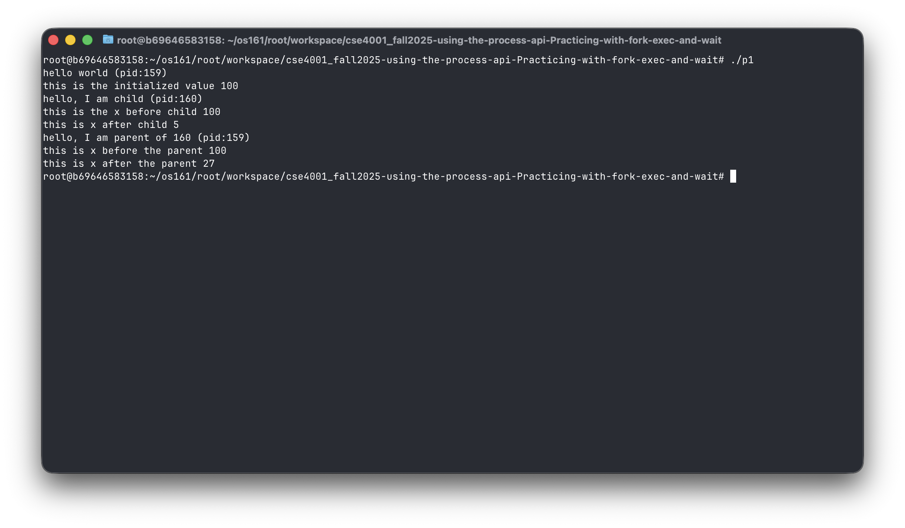

# Assignment: Practicing the Process API
Practicing with fork, exec, wait. 

### Overview

In this assignment, you will practice using the Process API to create processes and run programs under Linux. The goal is to gain hands-on experience with system calls related to process management. Specifically, you will practice using the unix process API functions 'fork()', 'exec()', 'wait()', and 'exit()'. 

⚠️ Note: This is not an OS/161 assignment. You will complete it directly on Linux. 

Use the Linux in your CSE4001 container. If you are using macOS, you may use the Terminal (you may need to install development tools with C/C++ compilers). 

**Reference Reading**: Arpaci-Dusseau, *Operating Systems: Three Easy Pieces*, Chapter 5 (Process API Basics)
 👉 [Chapter 5 PDF](http://pages.cs.wisc.edu/~remzi/OSTEP/cpu-api.pdf)

---

### **Steps to Complete the Assignment**

1. **Accept the GitHub Classroom Invitation**
    [GitHub Link](https://classroom.github.com/a/FZh4BrQG)
2. **Set up your Repository**
   - Clone the assignment repository.
3. **Study the Reference Materials**
   - Read **Chapter 5**.
   - Download and explore the sample programs from the textbook repository:
      [OSTEP CPU API Code](https://github.com/remzi-arpacidusseau/ostep-code/tree/master/cpu-api).
4. **Write Your Programs**
   - Adapt the provided example code to answer the assignment questions.
   - Each program should be clear, well-commented, and compile/run correctly.
   - Add your solution source code to the repository.

5. **Prepare Your Report**
   - Answer the questions in the README.md file. You must edit the README.md file and not create another file with the answers. 
   - For each question:
     - Include your **code**.
     - Provide your **answer/explanation**.
6. **Submit Your Work via GitHub**
   - Push both your **program code** to your assignment repository.
   - This push will serve as your submission.
   - Make sure all files, answers, and screenshots are uploaded and rendered properly.


---
### Questions
1. Write a program that calls `fork()`. Before calling `fork()`, have the main process access a variable (e.g., x) and set its value to something (e.g., 100). What value is the variable in the child process? What happens to the variable when both the child and parent change the value of x?


```cpp
#include <stdio.h>
#include <stdlib.h>
#include <unistd.h>

int
main(int argc, char *argv[])
{
    printf("hello world (pid:%d)\n", (int) getpid());
    int x = 100;
    printf("this is the initialized value %d\n",x);
    int rc = fork();
    if (rc < 0) {
        // fork failed; exit
        fprintf(stderr, "fork failed\n");
        exit(1);
    } else if (rc == 0) {
        // child (new process)
        printf("hello, I am child (pid:%d)\n", (int) getpid());
        printf("this is the x before child %d\n",x);
        x = 5;
        printf("this is x after child %d\n",x);
    } else {
        // parent goes down this path (original process)
        printf("hello, I am parent of %d (pid:%d)\n",
               rc, (int) getpid());
        printf("this is x before the parent %d\n",x);
        x = 27;
        printf("this is x after the parent %d\n",x);
    }
    return 0;
}
```



This program initializes a variable before fork(). Both parent and child start with the same value, but after the fork each has its own copy, so changes in one process do not affect the other.

2. Write a program that opens a file (with the `open()` system call) and then calls `fork()` to create a new process. Can both the child and parent access the file descriptor returned by `open()`? What happens when they are writing to the file concurrently, i.e., at the same time?

```cpp
#include <stdio.h>
#include <stdlib.h>
#include <unistd.h>
#include <string.h>
#include <fcntl.h>
#include <assert.h>
#include <sys/wait.h>

int
main(int argc, char *argv[])
{
    printf("hello world (pid:%d)\n", (int) getpid());
    int fd = open("out.txt", O_CREAT | O_TRUNC | O_WRONLY /* | O_APPEND */, 0644);
    if (fd < 0) { perror("open"); exit(1); }

    int rc = fork();
    if (rc < 0) {
        // fork failed; exit
        fprintf(stderr, "fork failed\n");
        close(fd);
        exit(1);
    } else if (rc == 0) {
        // child (new process)
        printf("hello, I am child (pid:%d)\n", (int) getpid());
        const char *msg = "child\n";
        for (int i = 0; i < 10; i++) {
            if (write(fd, msg, (int)strlen(msg)) < 0) { perror("write(child)"); _exit(1); }
            sleep(1);
        }
        close(fd);
        _exit(0);
    } else {
        // parent goes down this path (original process)
        const char *msg = "parent\n";
        for (int i = 0; i < 10; i++) {
            if (write(fd, msg, (int)strlen(msg)) < 0) { perror("write(parent)"); exit(1); }
            sleep(1);
        }
        close(fd);
        int wc = wait(NULL);
        assert(wc >= 0);
    }
    return 0;
}
```


A file is opened before fork(), so both processes inherit the same file descriptor pointing to one open-file description (same offset). Both can write concurrently, leading to interleaving unless O_APPEND is used, in which case each write() appends atomically but order is still nondeterministic.

3. Write another program using `fork()`.The child process should print “hello”; the parent process should print “goodbye”. You should try to ensure that the child process always prints first; can you do this without calling `wait()` in the parent?

```cpp
#include <stdio.h>
#include <stdlib.h>
#include <unistd.h>
#include <string.h>
#include <fcntl.h>
#include <assert.h>
#include <sys/wait.h>

int
main(int argc, char *argv[])
{
    int p[2];
    if (pipe(p) < 0) { perror("pipe"); exit(1); }

    int rc = fork();
    if (rc < 0) {
        fprintf(stderr, "fork failed\n");
        exit(1);
    } else if (rc == 0) {
        close(p[0]); // child writes signal after printing
        printf("hello (child pid:%d)\n", (int)getpid());
        fflush(stdout);
        if (write(p[1], "x", 1) != 1) perror("write");
        close(p[1]);
        _exit(0);
    } else {
        close(p[1]); // parent waits by reading one byte
        char b;
        if (read(p[0], &b, 1) != 1) perror("read");
        close(p[0]);
        printf("goodbye (parent pid:%d, child:%d)\n", (int)getpid(), rc);
        // no wait(); child already exited or will soon; pipe enforced print order
    }
    return 0;
}  
```


This program uses a pipe for synchronization: the child prints “hello” and writes a byte to the pipe, which the parent reads before printing “goodbye.” This guarantees the child always prints first without needing wait().

4. Write a program that calls `fork()` and then calls some form of `exec()` to run the program `/bin/ls`. See if you can try all of the variants of `exec()`, including (on Linux) `execl()`, `execle()`, `execlp()`, `execv()`, `execvp()`, and `execvpe()`. Why do you think there are so many variants of the same basic call?

```cpp
#include <stdio.h>
#include <stdlib.h>
#include <unistd.h>
#include <string.h>
#include <fcntl.h>
#include <assert.h>
#include <sys/wait.h>

extern char **environ;

int
main(int argc, char *argv[])
{
    const char *which = (argc > 1) ? argv[1] : "execl";

    int rc = fork();
    if (rc < 0) {
        fprintf(stderr, "fork failed\n");
        exit(1);
    } else if (rc == 0) {
        if (strcmp(which, "execl") == 0) {
            execl("/bin/ls", "ls", "-l", "/", (char*)NULL);
        } else if (strcmp(which, "execle") == 0) {
            char *envp[] = { "LANG=C", "FOO=BAR", NULL };
            execle("/bin/ls", "ls", "-l", "/", (char*)NULL, envp);
        } else if (strcmp(which, "execlp") == 0) {
            execlp("ls", "ls", "-l", "/", (char*)NULL);
        } else if (strcmp(which, "execv") == 0) {
            char *args[] = { "ls", "-l", "/", NULL };
            execv("/bin/ls", args);
        } else if (strcmp(which, "execvp") == 0) {
            char *args[] = { "ls", "-l", "/", NULL };
            execvp("ls", args);
        } else if (strcmp(which, "execvpe") == 0) { // GNU extension
            char *args[] = { "ls", "-l", "/", NULL };
            char *envp[] = { "LANG=C", "FOO=BAZ", NULL };
            execvpe("ls", args, envp);
        } else {
            fprintf(stderr, "usage: %s [execl|execle|execlp|execv|execvp|execvpe]\n", argv[0]);
            _exit(2);
        }
        perror("exec"); // reach here only if exec failed
        _exit(1);
    } else {
        int wc = wait(NULL);
        assert(wc >= 0);
    }
    return 0;
}
```


The child process replaces itself with /bin/ls using different exec*() variants. These functions differ in how arguments are passed (list vs. vector), whether PATH is searched, and whether a custom environment is supplied.

5. Now write a program that uses `wait()` to wait for the child process to finish in the parent. What does `wait()` return? What happens if you use `wait()` in the child?

```cpp
#include <stdio.h>
#include <stdlib.h>
#include <unistd.h>
#include <string.h>
#include <fcntl.h>
#include <assert.h>
#include <sys/wait.h>
#include <errno.h>

int
main(int argc, char *argv[])
{
    int rc = fork();
    if (rc < 0) {
        fprintf(stderr, "fork failed\n");
        exit(1);
    } else if (rc == 0) {
        // child has no children; wait() should fail with ECHILD
        int st;
        pid_t r = wait(&st);
        if (r == -1) perror("child wait (expected ECHILD)");
        _exit(42); // exit code 42
    } else {
        int st;
        pid_t done = wait(&st);
        assert(done >= 0);
        if (WIFEXITED(st)) {
            printf("parent: child %d exited with code %d\n",
                   (int)done, WEXITSTATUS(st));
        } else if (WIFSIGNALED(st)) {
            printf("parent: child %d killed by signal %d\n",
                   (int)done, WTERMSIG(st));
        }
    }
    return 0;
}
```


The parent calls wait() to reap its child and retrieve the exit code, while the child tries wait() but gets an error (ECHILD) because it has no children. This demonstrates how wait() works differently in parent vs. child.

6. Write a slight modification of the previous program, this time using `waitpid()` instead of `wait()`. When would `waitpid()` be useful?

```cpp
#include <stdio.h>
#include <stdlib.h>
#include <unistd.h>
#include <string.h>
#include <fcntl.h>
#include <assert.h>
#include <sys/wait.h>

int
main(int argc, char *argv[])
{
    int rcA = fork();
    if (rcA < 0) { fprintf(stderr, "fork A failed\n"); exit(1); }
    if (rcA == 0) { usleep(200000); _exit(10); } // child A exits later

    int rcB = fork();
    if (rcB < 0) { fprintf(stderr, "fork B failed\n"); exit(1); }
    if (rcB == 0) { usleep(100000); _exit(20); } // child B exits earlier

    int st;
    pid_t r = waitpid(rcA, &st, 0);         // specifically wait for A first
    assert(r == rcA);
    printf("waited for A (%d), exit=%d\n", rcA,
           WIFEXITED(st) ? WEXITSTATUS(st) : -1);

    r = waitpid(-1, &st, 0);                // reap the remaining child
    assert(r == rcB);
    printf("waited for B (%d), exit=%d\n", rcB,
           WIFEXITED(st) ? WEXITSTATUS(st) : -1);

    return 0;
}
```


The parent uses waitpid() to wait for a specific child first, even though another finishes earlier. This shows the control waitpid() provides over which child to reap, unlike wait() which reaps any child.

7. Write a program that creates a child process, and then in the child closes standard output (`STDOUT FILENO`). What happens if the child calls `printf()` to print some output after closing the descriptor?

```cpp
#include <stdio.h>
#include <stdlib.h>
#include <unistd.h>
#include <string.h>
#include <fcntl.h>
#include <assert.h>
#include <sys/wait.h>

int
main(int argc, char *argv[])
{
    int rc = fork();
    if (rc < 0) {
        fprintf(stderr, "fork failed\n");
        exit(1);
    } else if (rc == 0) {
        close(STDOUT_FILENO);
        printf("you should NOT see this line (child pid:%d)\n", (int)getpid());
        if (fflush(stdout) != 0) perror("child fflush"); // expect EBADF
        _exit(0);
    } else {
        printf("parent still has stdout (pid:%d, child:%d)\n", (int)getpid(), rc);
        int wc = wait(NULL);
        assert(wc >= 0);
    }
    return 0;
}
```


The child closes STDOUT_FILENO and then calls printf(). Because fd 1 is invalid, flushing stdout fails with “Bad file descriptor,” demonstrating what happens when you write to a closed descriptor.
